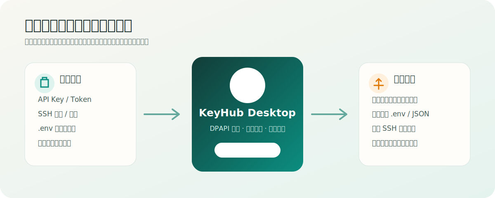

# KeyHub Desktop

> 面向个人开发者的 Windows 本机项目与密钥工作台：在一个界面里管理项目、API 凭据、运行状态和服务器部署。




## 为什么需要它

个人项目通常会逐渐出现这些问题：API Key 散落在多个 `.env`，SSH 私钥与服务器关系靠记忆，项目能否启动只能打开终端试，密钥修改后又不知道哪些服务需要重新部署。

KeyHub Desktop 把这些关系整理成三层：

1. **密钥只保存一次**：API Key、Token、密码和 SSH 私钥使用当前 Windows 用户的 DPAPI 加密。
2. **项目只声明需要什么**：仓库中的 `.keyhub.json` 仅包含变量名、启动命令和健康检查，不包含密钥值。
3. **运行时再交付**：启动项目时注入环境变量，或由用户确认后导出配置、通过 SSH 部署到服务器。

项目代码仍然读取普通环境变量，不需要引用 KeyHub SDK，也不会被平台锁定。

## 主要能力

### 项目工作台

- 扫描并识别 Git、Node.js、.NET、Python、Java 和 Rust 项目。
- 区分“源码存在”“依赖就绪”“配置完整”和“实际运行”四种状态。
- 在桌面界面直接启动、停止项目，查看经过密钥遮盖的运行日志。
- 为 Web 项目提供“打开前端”入口；本机回环探针可识别外部运行中的服务。
- 显示 Git 分支、变量映射、部署目标和需要处理的配置缺口。

### 凭据与 API

- 管理 API Key、Token、账号密码、SSH 私钥、证书和多行文本。
- 支持标签、搜索、过期时间、脱敏查看、复制和使用关系反查。
- API 连接档案引用已有密钥，不复制真实值。
- 扫描 `.env*` 和 `%USERPROFILE%\.ssh`，确认后导入；不会自动删除原文件。
- 未被任何项目、API 或服务器引用的密钥可以安全筛选和清理。

### 运行与部署

- `keyhub run` 只在目标进程环境中注入密钥，不生成临时文件。
- 显式导出 `.env` 或 JSON 时先预览变量名，再原子替换目标文件。
- 通过 SSH.NET 从内存加载私钥，向 Linux 或 Windows OpenSSH 主机部署配置。
- 首次连接展示并固定 SHA256 主机指纹。
- 可按预设执行 `systemctl restart <service>` 或 `Restart-Service -Name <service>`。

## 快速开始

### 从源码运行桌面端

开发机需要 Windows 10 19041+、.NET 10 SDK 和 Node.js 22：

```powershell
git clone https://github.com/ddbbiii/keyhub-desktop.git
cd keyhub-desktop
dotnet run --project .\src\KeyHub.Desktop\KeyHub.Desktop.csproj
```

桌面构建会在 `src/KeyHub.Desktop/WebApp` 自动执行 `npm ci` 和 `npm run build`。React 静态资源随后嵌入桌面发布物，运行时不会启动本地 Web 服务器。

### 接入第一个项目

1. 在“凭据与 API”中新建或导入密钥。
2. 在“项目”中扫描本机目录，或手动添加项目。
3. 将项目所需变量映射到已有密钥，例如 `OPENAI_API_KEY → OpenAI API`。
4. 处理项目卡片中的依赖检查和缺失配置。
5. 点击“启动项目”；有前端入口时可直接点击“打开前端”。

目标项目仍按原有方式读取环境变量：

```csharp
var apiKey = Environment.GetEnvironmentVariable("OPENAI_API_KEY");
```

## `.keyhub.json` 项目清单

项目可以提交一份不含秘密的清单，让 KeyHub 知道如何检查和启动它：

```json
{
  "schema_version": 1,
  "project_id": "demo-api",
  "display_name": "Demo API",
  "required_environment": ["OPENAI_API_KEY", "SMTP_PASSWORD"],
  "optional_environment": ["CORS_ORIGINS"],
  "default_command": "dotnet run --project src/Demo.Api",
  "runtime_probe": "http://127.0.0.1:5080/health",
  "entry_points": [
    { "label": "打开管理台", "url": "http://localhost:5080" }
  ],
  "readiness_checks": [
    { "label": "Node 依赖", "path": "node_modules" },
    { "label": "本地缓存", "path": ".cache", "optional": true }
  ]
}
```

规则说明：

- 相对路径以项目目录为基准，机器专属绝对路径不要提交到公开仓库。
- `required_environment` 缺少映射时阻止启动；`optional_environment` 只显示提醒。
- `runtime_probe` 仅允许本机回环地址，避免桌面 UI 变成通用网络探测器。
- 没有 `readiness_checks` 的项目显示“未验证”，不会仅因源码目录存在就标记为就绪。
- 只有 KeyHub 自己启动的进程树可以从界面停止；探针发现的外部服务不会被误杀。

## CLI

桌面端覆盖日常操作，CLI 适合脚本、构建和排障：

```powershell
keyhub doctor
keyhub project list
keyhub secret import --file .env
keyhub secret prune
keyhub bind auto --project demo-api
keyhub run --project demo-api -- dotnet run
keyhub export --project demo-api --format dotenv --output .env
keyhub deploy production-demo
```

安装版会把 `cli` 子目录加入当前用户 PATH；便携版可直接运行 `cli\keyhub.exe`。

## 架构与安全边界

| 层 | 技术 | 职责 |
| --- | --- | --- |
| 桌面宿主 | .NET 10 / WPF / WPF-UI | 窗口、进程、剪贴板、DPAPI、SSH 和文件系统操作 |
| 前端界面 | React / TypeScript / WebView2 | 项目、凭据、部署与日志的交互界面 |
| 核心存储 | SQLite + DPAPI | 保存元数据和当前用户可解密的密文 |
| CLI | .NET | 环境注入、导出、诊断和自动化入口 |

WebView2 只加载应用内置的 `https://app.keyhub.local` 静态资源。网页层只接收项目元数据和脱敏状态；解密、SSH 私钥、进程环境和任意文件写入均保留在受限的 C# 命令边界中。

数据库位于 `%LocalAppData%\KeyHubDesktop\keyhub.db`。DPAPI 使用 `DataProtectionScope.CurrentUser`，没有云同步、恢复密码或自动备份；Windows 用户配置丢失后，原密文可能无法恢复。

KeyHub 的目标是减少密钥散落和误提交，不用于抵御同一 Windows 用户下的恶意软件、管理员攻击或内存窃取。详见 [SECURITY.md](SECURITY.md) 和 [PRIVACY.md](PRIVACY.md)。

## 开发与发布

```powershell
dotnet test .\KeyHub.slnx -c Release
dotnet publish .\src\KeyHub.Desktop\KeyHub.Desktop.csproj -c Release -r win-x64 --self-contained true
```

推送 `v*` 标签后，GitHub Actions 会执行测试、密钥扫描，并生成自包含 x64 便携 ZIP、Inno Setup 用户级安装包和 SHA256。当前发布物未签名，Windows SmartScreen 可能显示提示。

## English summary

KeyHub Desktop is a local-first Windows project and secret desk. It stores API keys, tokens and SSH credentials with current-user DPAPI, maps them to projects, injects them into child-process environments, and can explicitly export or deploy configuration over SSH. It has no cloud sync, telemetry, team sharing or browser autofill.

## License

[MIT](LICENSE)
